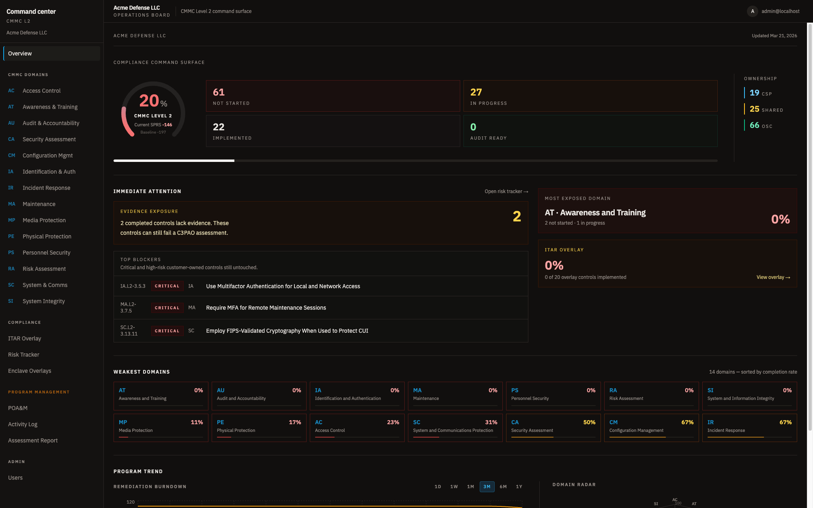
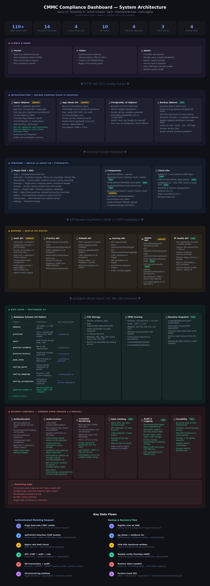

# CMMC Dashboard

Internal compliance tracking dashboard for CMMC Level 2 and ITAR overlay work.



Designed for a small trusted user set — not a public-facing product. All data stays on your machine inside Docker.

---

## What it does

- **Practice tracking** — 110 CMMC Level 2 practices across 14 domains + 20 ITAR controls, each with status, risk level, owner, due date, and notes
- **SPRS scoring** — live DoD Assessment Methodology v1.2.1 score with per-domain breakdown and compliance gauge
- **Evidence management** — attach files and URLs to any practice; evidence drawer with assessment objective status tracking
- **POA&M tracker** — create and manage Plan of Action & Milestones with milestone progress, responsible party, and scheduled completion
- **GCC High overlay** — Microsoft Product Placemat mappings showing inheritance and customer responsibility per practice
- **Activity log** — full history of every practice change with who made it and when
- **Assessment report** — printable report export (Ctrl+P / Cmd+P)
- **Admin panel** — user management (create/edit/delete), backup/restore, audit log, system health

---

## Getting started (5 minutes)

### 1. Install Docker Desktop

[https://www.docker.com/products/docker-desktop](https://www.docker.com/products/docker-desktop) — download, install, wait for "Docker Desktop is running."

### 2. Get the code

```bash
git clone https://github.com/gtj105/cmmc-dashboard.git
cd cmmc-dashboard/dashboard
```

Or download the ZIP from GitHub and unzip it.

### 3. Bootstrap

```bash
bash ./scripts/bootstrap.sh
```

One command. It generates secrets, starts the database, seeds 130 practices, creates a default admin, and starts the full stack. Takes about 60 seconds on first run.

The app will be at **http://localhost** when it finishes.

### 4. Log in

Default: `admin@localhost` / `admin`

**Change this immediately** via the profile menu → Change Password.

---

## Day-to-day commands

```bash
# Start
bash ./scripts/start-runtime.sh

# Stop (data preserved)
bash ./scripts/stop-runtime.sh

# Add a user (they'll be prompted to set their own password on first login)
bash ./scripts/create-admin.sh --email jane@example.com --name "Jane Doe" --password "temp-pass-123"

# Export data to JSON
bash ./scripts/export-runtime.sh

# Import from a JSON backup
bash ./scripts/import-runtime.sh --file exports/cmmc-backup-2026-03-27.json

# Verify DB invariants
bash ./scripts/validate-runtime.sh

# Post-deploy smoke test
bash ./scripts/smoke-test.sh
```

---

## User roles

| Role | What they can do |
|---|---|
| `viewer` | Read-only — browse practices, evidence, POA&M, reports |
| `editor` | Update practice status/risk, upload evidence, create/edit POA&M items |
| `admin` | Everything — plus user management, backup/restore, audit log |

### Onboarding a new user

Create their account via the Admin panel or `create-admin.sh`. They receive a temporary password. On first login they are redirected to `/set-password` and **cannot access the dashboard until they set a permanent password**. Share the temporary password out-of-band (Signal, 1Password, etc).

---

## Security

- Secrets (DB password, NextAuth secret) generated by `setup-secrets.sh` and stored in `./secrets/` — never committed to git; NextAuth secret exposed to Edge middleware via secure entrypoint script, not `.env`
- Passwords are bcrypt-hashed (10 rounds); minimum 12 characters enforced
- CSRF double-submit cookie protection on all mutation endpoints with timing-safe comparison
- JWT sessions with 24-hour expiry; tokens are revoked server-side on logout and on user deletion — revocation enforced on every API request via `getAuthSession()`
- Login rate limiting persisted in the database (survives restarts) — 5 attempts triggers 15-minute lockout
- Full Content Security Policy, nginx rate limiting (10 req/s API, 3 req/s login), structured audit log
- Zod input validation on all API routes and on backup restore — row-level schema enforcement rejects malformed payloads before hitting the DB
- Backup restore never accepts password hashes from file — all restored users are force-prompted to set a new password
- Evidence URLs validated: http/https scheme only, 2048-character limit
- Health endpoint returns generic errors only — detailed DB errors logged server-side
- The database port is bound to `127.0.0.1` only and never exposed to the network

---

## Documentation

| Doc | Purpose |
|---|---|
| [docs/DEPLOYMENT.md](./docs/DEPLOYMENT.md) | First-time setup, SSL activation, configuration reference |
| [docs/DEVELOPMENT.md](./docs/DEVELOPMENT.md) | Dev runtime with live reload, isolated from production |
| [docs/RUNBOOK.md](./docs/RUNBOOK.md) | User management, backup/restore, incident response, health checks |
| [docs/SECURITY-AND-OPERATIONS.md](./docs/SECURITY-AND-OPERATIONS.md) | Security controls, audit log, hardening notes |

---

## Architecture

- **Next.js 14** (App Router, standalone output) — server-rendered pages, API routes
- **PostgreSQL 15** — practices, POA&M, evidence metadata, audit log, session revocation, login rate limiting, user token invalidation, migration tracking
- **Nginx** — reverse proxy, rate limiting, security headers, TLS-ready
- **Docker Compose** — four services: `db`, `app`, `nginx`, `backup`
- **Automated backups** — nightly pg_dump + evidence tar.gz, 30-day daily retention, weekly verification

[](docs/architecture.html)

---

## Running tests

Static test suite (no Docker required):

```bash
python3 -m unittest discover -s tests -v
```

Post-deploy smoke test (stack must be running):

```bash
bash ./scripts/smoke-test.sh
```
