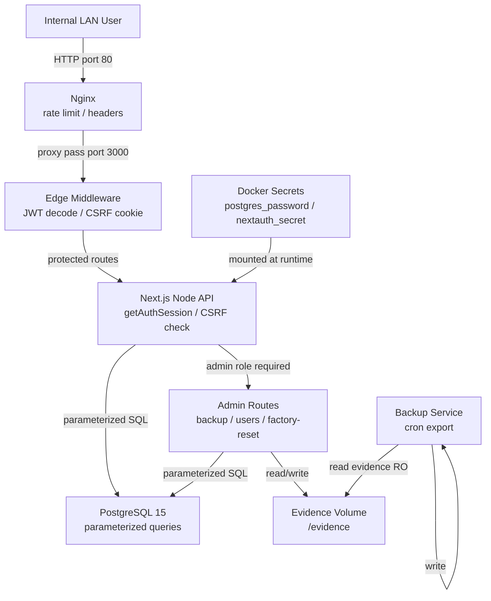

# CMMC Dashboard — Threat Model

**Date:** 2026-03-28
**Scope:** Full application — `/Users/gtj105/repos/cmmc-dashboard`
**Analyst:** Claude Sonnet 4.6 (automated, AppSec-grade)

---

## Executive Summary

The CMMC Dashboard is a well-hardened internal web application with strong foundational controls: parameterized SQL throughout, double-submit CSRF with timing-safe comparison, multi-layer rate limiting, per-token and per-user JWT revocation, and comprehensive audit logging. The highest-risk themes are: **(1) admin account compromise** — a single compromised admin can destroy compliance records, wipe the audit trail, and export all data; **(2) backup integrity** — exported backups carry no signature, enabling offline tampering before re-import; **(3) CSP gaps** — `unsafe-inline`/`unsafe-eval` weaken the XSS barrier on an app that renders user-supplied text; and **(4) TLS status** — unconfirmed TLS termination means credentials could travel in plaintext on the internal network. No critical pre-auth vulnerabilities were identified. The residual risk profile is appropriate for a single-tenant internal tool provided the open items below are resolved.

---

## Scope and Assumptions

**In scope:** All runtime code under `src/`, `scripts/`, `nginx.conf`, `docker-compose.yml`, `Dockerfile`, `docker-entrypoint.sh`.

**Out of scope:** CI/CD pipelines, host OS hardening, upstream reverse proxy/load balancer configuration, client browser security.

**Explicit assumptions:**

| Assumption | Confidence | Impact if wrong |
|---|---|---|
| Deployed on internal network, not public internet | High (user confirmed) | Attacker model expands significantly; all medium threats become high |
| Single-tenant, single organization | High (user confirmed) | No cross-tenant isolation threats |
| Data is compliance tracking metadata only — no CUI/PII | High (user confirmed) | Data classification risk changes |
| TLS terminates at an upstream proxy or load balancer | **Unknown** | If no TLS: credentials and tokens in plaintext on LAN |
| No SSO/LDAP — credentials provider only | High (inferred from `src/lib/auth.ts`) | Low impact |
| Nginx is the outermost app-layer entry point | High (inferred from `docker-compose.yml`) | Low impact |

**Open questions:**

1. Is TLS configured at nginx or an upstream load balancer? If neither, credentials traverse the internal network in cleartext.
2. Is there a backup retention or off-site storage policy? Unencrypted backups at rest are a meaningful exposure.

---

## System Model

### Primary Components

| Component | Role | Evidence |
|---|---|---|
| **Nginx** | Reverse proxy, rate limiting, security headers, static asset cache | `nginx.conf` |
| **Next.js 14 app** | API routes (Node.js runtime), Edge middleware (JWT check, CSRF cookie), React UI | `src/`, `Dockerfile` |
| **PostgreSQL 15** | Persistent store: users, practices, POAM, evidence metadata, audit log, session revocation, migration tracking | `docker-compose.yml`, `scripts/migrations/` |
| **Backup service** | Scheduled cron export to `/backups/` volume | `docker-compose.yml` |
| **Docker secrets** | `postgres_password.txt`, `nextauth_secret.txt` mounted at `/run/secrets/` | `docker-compose.yml`, `docker-entrypoint.sh` |

### Data Flows and Trust Boundaries

**Boundary 1 — Internal LAN → Nginx (port 80)**
- Data types: HTTP requests, session cookies, CSRF headers, file uploads
- Protocol: HTTP (TLS status unconfirmed — see open question)
- Security guarantees: nginx rate limits (3 req/s login, 10 req/s API); `client_max_body_size 26M`; security headers set
- Validation: none at this layer; payload inspection delegated to app

**Boundary 2 — Nginx → Next.js app (Docker internal network, port 3000)**
- Data types: proxied HTTP, multipart uploads, JSON bodies
- Protocol: HTTP over Docker bridge network (not internet-routable)
- Security guarantees: Docker network isolation; app runs as non-root UID 1001; `no-new-privileges`

**Boundary 3 — Edge middleware → Node.js API routes (same process)**
- Data types: JWT cookie, CSRF cookie, request headers
- Edge runtime: cryptographic JWT decode only — no DB access possible
- Node.js runtime: full `getAuthSession()` — checks `revoked_tokens` + `user_invalidations` tables
- Gap: revoked tokens accepted at Edge layer for page navigation (acceptable — no sensitive data served)

**Boundary 4 — Next.js app → PostgreSQL (Docker internal network, port 5432)**
- Data types: SQL queries, result sets
- Protocol: TCP over Docker bridge (DB port not exposed to host)
- Security guarantees: parameterized queries via `postgres` tagged templates throughout; no `unsafe()` calls; DB user `cmmc_user` (not superuser)

**Boundary 5 — Admin user → Admin API routes**
- Data types: backup JSON (10 MB max), user mutations, factory reset
- Elevated trust: admin role checked via `requireRole(session, 'admin')`
- Weaknesses: no MFA; no approval workflow; single admin model

**Boundary 6 — Docker host → containers (secrets)**
- Data types: `postgres_password.txt`, `nextauth_secret.txt`
- Protocol: Docker secrets mounted as files at `/run/secrets/`
- Security guarantees: files not exposed as env vars; `docker-entrypoint.sh` reads and exports at runtime

### Diagram

---

## Assets and Security Objectives

| Asset | Why it matters | Objective |
|---|---|---|
| **CMMC practice status & scores** | Falsified compliance status could misrepresent readiness to auditors or leadership | Integrity, Confidentiality |
| **POAM items** | Remediation plans reveal security gaps; tampering hides risk | Integrity, Confidentiality |
| **Evidence files** | Uploaded audit artifacts; deletion or substitution undermines compliance posture | Integrity, Availability |
| **User credentials (password hashes)** | Compromise enables account takeover | Confidentiality |
| **NextAuth secret** | JWT signing key; compromise allows forging arbitrary sessions | Confidentiality, Integrity |
| **PostgreSQL password** | DB credential; compromise allows direct data access bypassing all app controls | Confidentiality |
| **Audit log (`security_events`)** | Forensic record; destruction prevents incident investigation | Integrity, Availability |
| **Backup files** | Full data export; unencrypted at rest; tampering before re-import corrupts DB | Confidentiality, Integrity |

---

## Attacker Model

### Capabilities

- **Authenticated internal user (Viewer/Editor):** Can read all compliance data, submit evidence, modify practices/POAM within their role. Could attempt privilege escalation or data corruption within their access scope.
- **Compromised admin account:** Full control — can export all data, wipe and restore DB, delete users, clear audit log.
- **LAN-adjacent attacker (no credentials):** Can reach port 80; limited to unauthenticated surfaces (`/api/health`, login page). If no TLS: can intercept credentials or session cookies in transit.
- **Malicious admin (insider threat):** Can perform any of the above deliberately.

### Non-Capabilities

- **External internet attacker:** App is internal-network only; no public DNS/IP.
- **SQL injection:** All queries use parameterized templates — no injection surface.
- **SSRF via evidence URLs:** Evidence URLs are stored but never server-fetched; browser handles them.
- **Container escape via app:** App runs as non-root with `no-new-privileges`; no subprocess execution in app code.
- **Brute-force at scale:** Nginx rate limits + DB-backed lockout after 5 failures; not exploitable without slow/distributed approach.

---

## Entry Points and Attack Surfaces

| Surface | How reached | Trust boundary | Notes | Evidence |
|---|---|---|---|---|
| `POST /api/auth/callback/credentials` | Unauthenticated | LAN → Nginx → App | Rate-limited (3 req/s nginx, 5-attempt lockout); bcrypt compare | `src/lib/auth.ts` |
| `POST /api/admin/backup/import` | Admin + CSRF | Admin boundary | 10 MB limit; Zod validation; no integrity check | `src/app/api/admin/backup/import/route.ts` |
| `POST /api/admin/factory-reset` | Admin + CSRF | Admin boundary | Full DB wipe + audit log clear | `src/app/api/admin/factory-reset/route.ts` |
| `GET /api/admin/backup/export` | Admin | Admin boundary | Unencrypted JSON; no signature | `src/app/api/admin/backup/export/route.ts` |
| `POST /api/admin/users` | Admin + CSRF | Admin boundary | Create user; bcrypt hash | `src/app/api/admin/users/route.ts` |
| `PATCH/DELETE /api/admin/users/[id]` | Admin + CSRF | Admin boundary | Role change; deletion invalidates tokens | `src/app/api/admin/users/[id]/route.ts` |
| `POST /api/practices/[id]/evidence` | Editor + CSRF | App → FS | File upload (25 MB, MIME whitelist, UUID rename, path validation) or URL submit | `src/app/api/practices/[id]/evidence/route.ts` |
| `PATCH /api/practices/[id]` | Auth + CSRF | App → DB | Practice status/score update | `src/app/api/practices/[id]/route.ts` |
| `PATCH /api/poam/[id]` | Editor + CSRF | App → DB | POAM finding update | `src/app/api/poam/[id]/route.ts` |
| `GET /api/health` | Unauthenticated | LAN → Nginx → App | DB ping; errors masked | `src/app/api/health/route.ts` |
| Evidence file upload (multipart) | Editor + CSRF | App → FS | Extension + MIME whitelist; UUID filenames; path traversal guards | `src/lib/evidence.ts` |

---

## Top Abuse Paths

1. **Admin account compromise → compliance data falsification**
   Attacker phishes or brute-forces admin credentials → logs in → exports backup → modifies practice statuses offline (mark all as "Implemented") → re-imports → compliance dashboard shows false readiness. No integrity check on backup prevents detection.

2. **Admin account compromise → audit trail destruction**
   Attacker gains admin session → calls `POST /api/admin/factory-reset` → audit log (`security_events`) truncated → all prior security events erased → forensic investigation of the compromise becomes impossible.

3. **Credential intercept on unencrypted LAN (if no TLS)**
   Attacker on internal network runs ARP spoofing → intercepts HTTP traffic → captures `Authorization` cookie or POST body containing plaintext password → replays session or uses password directly.

4. **Stored XSS → session token exfiltration (CSP gap)**
   Editor submits malicious `<script>` in a practice owner/notes field → CSP `unsafe-inline` allows execution → victim admin loads the page → script exfiltrates CSRF cookie (httpOnly: false) and/or triggers admin actions on behalf of attacker.

5. **Slow credential brute force (nginx rate-limit bypass)**
   Internal attacker sends exactly 3 requests/second from multiple source IPs → bypasses per-IP nginx rate limit → 5 attempts per email → 15-minute lockout resets → over hours, exhausts common password list against known email addresses.

6. **Backup exfiltration via compromised admin**
   Admin downloads unencrypted backup JSON → file contains all users (emails), all POAM items (vulnerability details), all compliance gaps → shared outside organization or stored insecurely.

7. **Evidence file stored but audit trail wiped**
   Admin uploads falsified evidence file to a practice → factory-resets to clear audit log → no record of original file or the reset event → compliance auditor sees clean record.

8. **Token reuse window after logout (Edge layer)**
   User logs out (token revoked in DB) → attacker who copied the session cookie before logout → cookie still accepted by Edge middleware for page navigation (no DB check in Edge) → access to rendered pages until JWT expiry (max 24h). API calls are blocked.

---

## Threat Model Table

| Threat ID | Threat source | Prerequisites | Threat action | Impact | Impacted assets | Existing controls (evidence) | Gaps | Recommended mitigations | Detection ideas | Likelihood | Impact severity | Priority |
|---|---|---|---|---|---|---|---|---|---|---|---|---|
| TM-001 | Compromised/malicious admin | Valid admin session | Export backup, falsify compliance data offline, re-import | Falsified CMMC compliance posture | Practice status, POAM, audit log | Admin auth required; Zod validation on import; audit event logged | No HMAC/signature on backup; no diff or review step | Add HMAC-SHA256 signature to exports; verify on import; require second admin approval for restore | Alert on `backup.imported` event; diff imported data against prior state | Medium | High | **High** |
| TM-002 | Compromised/malicious admin | Valid admin session | Call factory-reset | Wipes all data and audit trail | All assets | Admin + CSRF required; audit event recorded before truncate | Audit log itself is cleared; single-admin model; no confirmation delay | Require typed confirmation phrase; ship audit events to external syslog before allowing reset | Alert on `factory.reset`; external SIEM would retain the event | Low | High | **High** |
| TM-003 | Internal LAN attacker | No credentials; no TLS | ARP/MITM intercept of HTTP traffic | Credential theft, session hijack | User credentials, NextAuth session | Internal network restriction; Docker network isolation | TLS not confirmed end-to-end | Configure TLS at nginx or confirm upstream terminator; enforce HSTS | Network-layer monitoring for unexpected ARP; nginx access log anomalies | Medium (if no TLS) | High | **High** (conditional on TLS status) |
| TM-004 | Authenticated editor | Valid editor session | Submit XSS payload in practice notes/owner field; CSP allows `unsafe-inline` | Script execution in victim's browser; CSRF token theft | Admin session, compliance data integrity | React default escaping; CSRF token validation on mutations | CSP `unsafe-inline`/`unsafe-eval` negates XSS defense; `cmmc-csrf-token` cookie is not httpOnly | Tighten CSP: remove `unsafe-inline`/`unsafe-eval`; use nonces; set CSRF cookie `httpOnly: true` (JS reads from meta tag instead) | CSP violation report endpoint; audit log for unexpected admin actions | Low | High | **Medium** |
| TM-005 | Internal attacker (no creds) | No credentials | Slow brute-force across multiple source IPs | Account takeover | User credentials | Nginx 3 req/s per IP; DB lockout after 5 attempts per email; bcrypt cost 10; dummy hash prevents email enumeration timing | Per-IP limit bypassable with multiple internal IPs; no MFA | Add global failed-login rate limit (not per-IP); consider MFA for admin accounts | Alert on >10 failed logins across any IPs within 5 min for same email; `login.locked_out` event | Low | Medium | **Medium** |
| TM-006 | Compromised admin | Valid admin session | Export all backup data | Full data exfiltration | All compliance data, user emails, vulnerability details | Admin auth required; audit log records export | Backup is unencrypted plaintext JSON; no access control on the file after export | Encrypt backup at rest with a key derived from the NextAuth secret; document secure storage policy | Alert on `backup.exported` outside business hours; frequency anomalies | Medium | Medium | **Medium** |
| TM-007 | Attacker with stolen JWT | Prior session cookie theft | Replay revoked token for page navigation at Edge | Read access to rendered pages (no API data) | Rendered page HTML | Token revocation at API layer (Node.js) blocks all data calls; 24h JWT expiry | Edge middleware cannot query DB; revoked token valid for page navigation until expiry | Accept as design tradeoff; shorten JWT maxAge to 4–8h to reduce window | Monitor for API 401s following successful page loads (anomaly pattern) | Low | Low | **Low** |
| TM-008 | Malicious editor | Valid editor session | Delete evidence file via API after compliance screenshot taken | Evidence record deleted; gaps in audit trail | Evidence files | Auth + CSRF required; audit event logged | No soft-delete or versioning on evidence files; file deleted from disk | Implement soft-delete (mark deleted, retain file); or retain file for configurable retention period | Alert on high-frequency `evidence.deleted` events from single actor | Low | Medium | **Low** |

---

## Criticality Calibration

For this repo (internal single-tenant compliance tool, no CUI):

| Priority | Definition | Examples |
|---|---|---|
| **Critical** | Pre-auth RCE, auth bypass, or cross-user data access with no attacker preconditions | Pre-auth SQL injection giving full DB access; JWT forgery due to weak secret; unauthenticated factory-reset |
| **High** | Authenticated attacker causes significant data integrity loss, exfiltration, or destruction; or network-layer compromise exposes credentials | Backup integrity falsification; audit trail destruction; credential intercept on unencrypted LAN |
| **Medium** | Authenticated attacker degrades security controls, bypasses secondary defenses, or achieves limited escalation | XSS via CSP gap; slow brute-force across IPs; unencrypted backup exfiltration |
| **Low** | Requires unusual preconditions; impact limited to information disclosure or temporary degradation | Revoked-token Edge window; evidence deletion by authorized user |

---

## Focus Paths for Security Review

| Path | Why it matters | Related Threat IDs |
|---|---|---|
| `src/app/api/admin/backup/import/route.ts` | Backup restore is the highest-integrity-risk operation; no signature verification | TM-001 |
| `src/app/api/admin/factory-reset/route.ts` | Full data + audit wipe with no confirmation gate | TM-002 |
| `nginx.conf` | TLS config (or absence), CSP headers, rate limit zones | TM-003, TM-004 |
| `src/middleware.ts` | Edge JWT decode only — no revocation check; CSP set here | TM-004, TM-007 |
| `src/lib/auth.ts` | Credentials provider, bcrypt compare, login rate-limit logic | TM-005 |
| `src/app/api/admin/backup/export/route.ts` | Unencrypted full-data export; no post-export access control | TM-006 |
| `src/lib/audit.ts` | Audit log write path; failure modes; whether events ship before factory-reset clears table | TM-002 |
| `src/lib/evidence.ts` + `src/app/api/practices/[id]/evidence/route.ts` | File upload path validation, MIME checking, disk deletion | TM-008 |

---

## Quality Check

- [x] All entry points covered (21 API routes reviewed; health, login, file upload, admin ops)
- [x] All trust boundaries represented in threats (LAN→Nginx, Edge→Node, App→DB, Admin boundary, Docker secrets)
- [x] Runtime vs CI/dev separation maintained (no CI pipeline threats included; dev tooling not in scope)
- [x] User clarifications reflected (internal network → attacker model scoped down; metadata only → no CUI threats)
- [x] Assumptions explicit; TLS open question flagged as conditional threat TM-003
- [x] Open questions documented in Scope section
